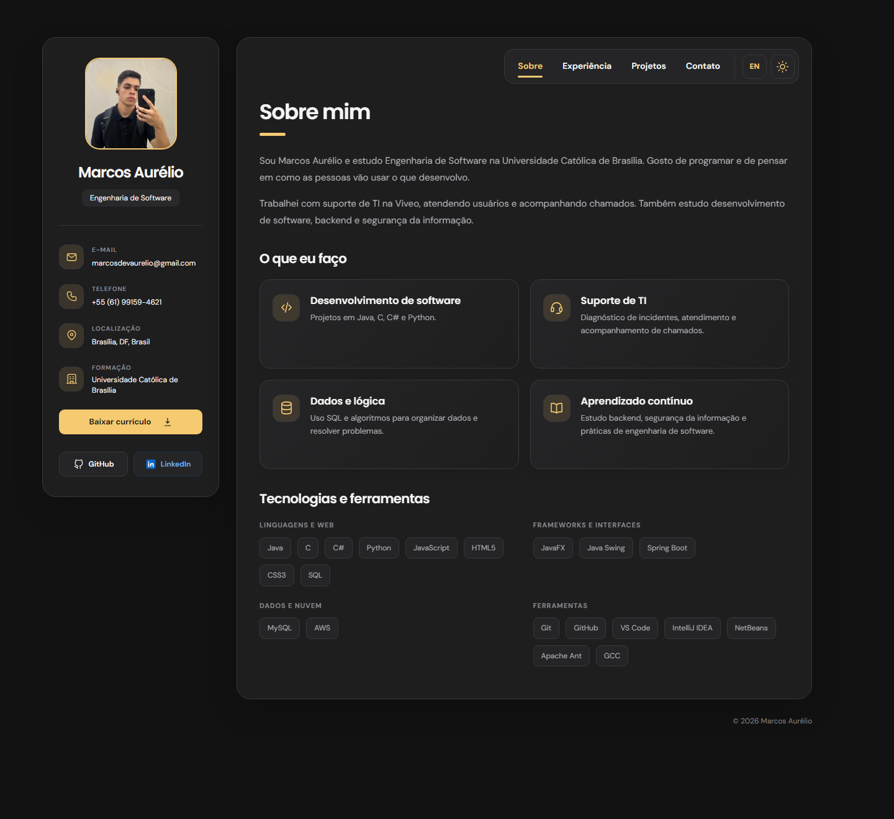
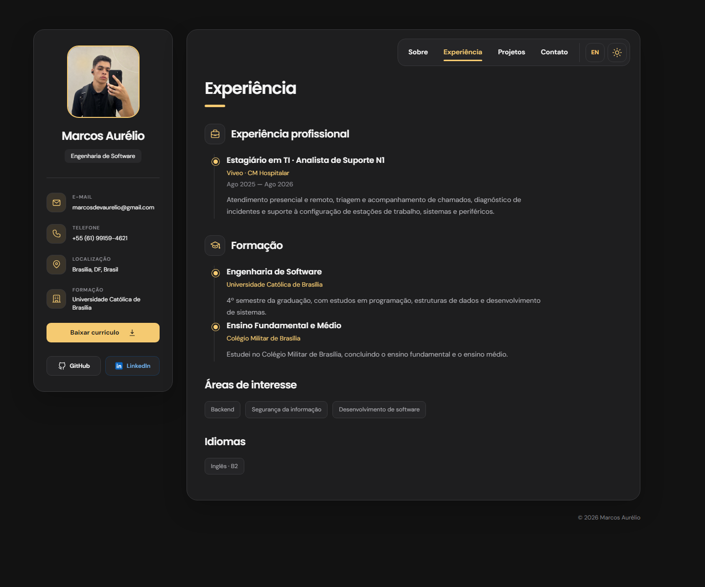
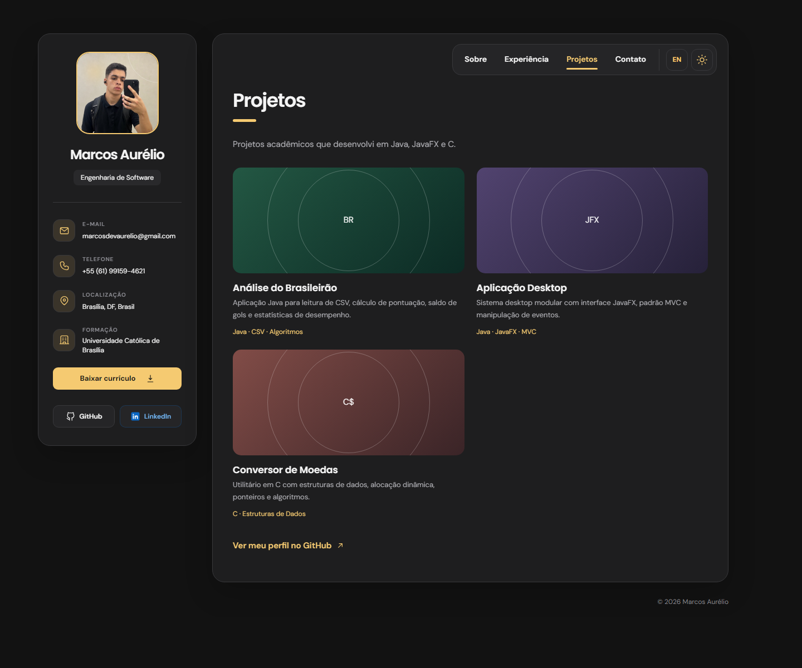
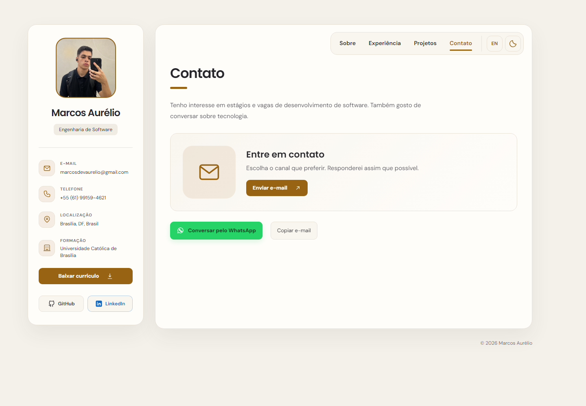
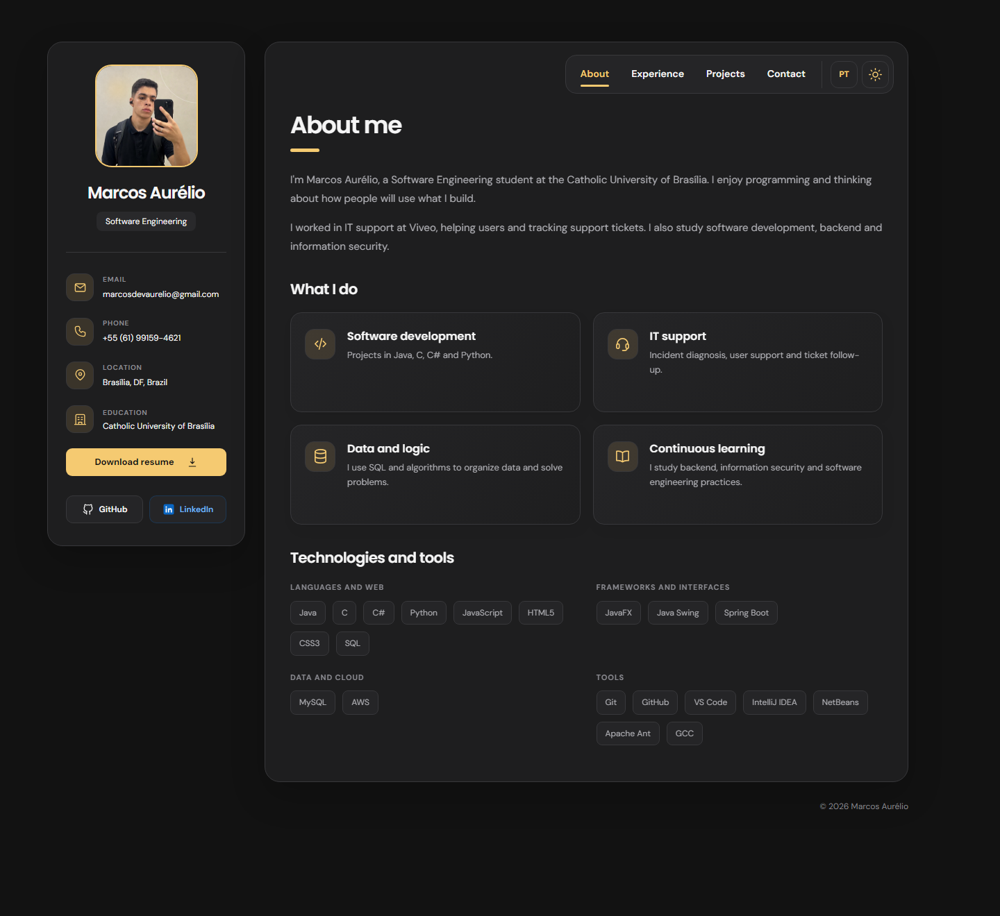
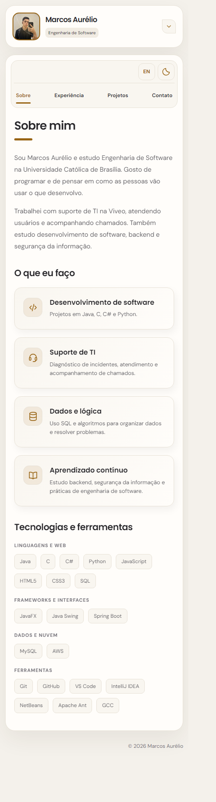

<div align="center">

<h1>Marcos Aurélio · Portfólio</h1>

<p><strong>Engenharia de Software · Desenvolvimento de software · Suporte de TI</strong><br>Brasília, DF</p>

<p>
  
  
  
  
</p>

<p>
  <a href="#visão-geral">Visão geral</a> ·
  <a href="#capturas-de-tela">Capturas</a> ·
  <a href="#recursos">Recursos</a> ·
  <a href="#como-executar">Como executar</a> ·
  <a href="#contato">Contato</a>
</p>

</div>

## Visão geral

Este é meu portfólio pessoal. Reuni nele minha experiência em suporte de TI, minha formação em Engenharia de Software e alguns projetos acadêmicos. O site usa HTML, CSS e JavaScript, sem etapa de build.

<div align="center">
  
</div>

## Capturas de tela

| Experiência | Projetos |
| :---: | :---: |
|  |  |

| Contato · tema claro | About · English |
| :---: | :---: |
|  |  |

<div align="center">
  <strong>Versão para celular</strong><br><br>
  
</div>

## Recursos

- As seções Sobre, Experiência, Projetos e Contato têm transições e podem ser abertas por `#sobre`, `#experiencia`, `#projetos` e `#contato`.
- O botão de idioma traduz a interface, os projetos e a mensagem do WhatsApp.
- Os controles de tema alternam entre claro e escuro. Idioma e tema ficam salvos no `localStorage`.
- Os ícones SVG estão no HTML, sem biblioteca externa.
- Em telas menores, os cartões se reorganizam e os contatos do perfil podem ser expandidos.
- Há links para e-mail, WhatsApp, GitHub e LinkedIn, além de um botão para copiar o endereço de e-mail.
- A foto `assets/foto-perfil.jpeg` aparece no perfil e pode ser ampliada.

## Projetos apresentados

| Projeto | Tecnologias | Descrição |
| --- | --- | --- |
| Análise do Brasileirão | Java, CSV, algoritmos | Leitura de dados de partidas e cálculo de pontuação, saldo de gols e estatísticas. |
| Aplicação Desktop | Java, JavaFX, MVC | Interface desktop modular com tratamento de eventos. |
| Conversor de Moedas | C, estruturas de dados | Utilitário com ponteiros, alocação dinâmica e algoritmos. |

## Como executar

1. Clone o repositório:

   ```bash
   git clone https://github.com/MarcosAAurelio/personal-portfolio-MarcosAAurelio.git
   cd personal-portfolio-MarcosAAurelio
   ```

2. Abra `index.html` no navegador. Para servir os arquivos localmente, você também pode usar o **Live Server** ou `python -m http.server 8000` e acessar `http://localhost:8000`.

Não há dependências para instalar. A fonte *DM Sans* e a fonte *Poppins* são carregadas pelo Google Fonts quando há conexão; o CSS usa uma fonte de reserva quando elas não estão disponíveis.

### Prévia de estados específicos

Os parâmetros de URL facilitam conferir um idioma, tema ou seção, por exemplo:

```text
index.html?theme=light&lang=en&tab=projetos
```

Valores aceitos: `theme=dark|light`, `lang=pt|en` e `tab=sobre|experiencia|projetos|contato`. A foto de perfil está em `assets/foto-perfil.jpeg`.

## Estrutura

```text
assets/screenshots/   Capturas usadas neste README
index.html            Estrutura e conteúdo das seções
styles.css            Estilos, temas e responsividade
script.js             Traduções, projetos e interações
README.md             Documentação principal
```

## Contato

<p>
  <a href="mailto:marcosdevaurelio@gmail.com"></a>
  <a href="https://github.com/MarcosAAurelio"></a>
  <a href="https://linkedin.com/in/eu-marcosaurelio-dev"></a>
  <a href="https://wa.me/5561991594621"></a>
</p>

<div align="center">
  <sub>Feito por Marcos Aurélio · 2026</sub>
</div>
